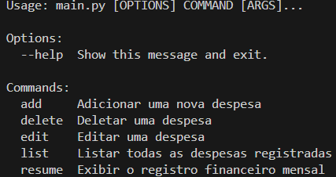
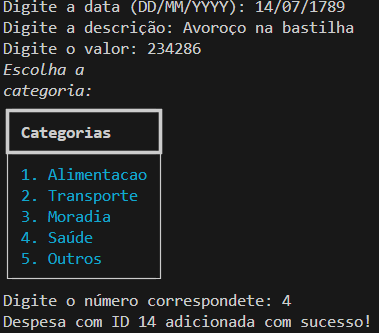
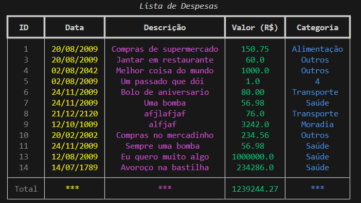
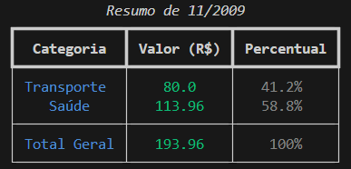
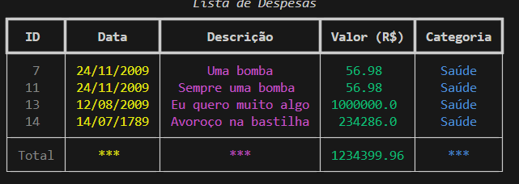

# Rastreador de Gastos
Este é um simples rastreador de python feito em python usando os módulos [Click](https://click.palletsprojects.com/en/stable/) e [Rich](https://rich.readthedocs.io/en/stable/). Este é um projeto da [NepsAcademy](https://neps.academy) que você pode acessar por esse link: https://neps.academy/br/course/python-mastery-bootcamp/lesson/rastreador-de-gastos.

---

## Diretórios:
rastreador-de-gastos <br />
├── README.md <br />
├── LICENSE <br />
├── assets <br />
│   ├── help.png <br />
│   ├── image1.png <br />
│   ├── image2 <br />
│   ├── image3.png <br />
│   └── image4.png <br />
├── main.py <br />
└── expenses.csv <br />

- ```README.md```: arquivo readme.
- ```LICENSE```: MIT license.
- ```assets```: pasta onde arquivos PNGs estão armazenados.
- ```main.py```: programa do rastreador de gastos.
- ```expenses.txt```: arquivo csv onde ficam as categorias usadas no rastreador.

---

## Como funciona

Caso você não conheça o funcionamento de CLIs, sugiro que veja mais: https://pt.wikipedia.org/wiki/Interface_de_linha_de_comandos

---

O primeiro comando que você pode utilizar é o `--help`:




---

A partir daí, você pode escolher as opções indicas. Aqui vão algumas imagens ilustrativas:










---

## Licence
This project is licensed under the MIT license. For more information, see the [License](LICENSE) file.
